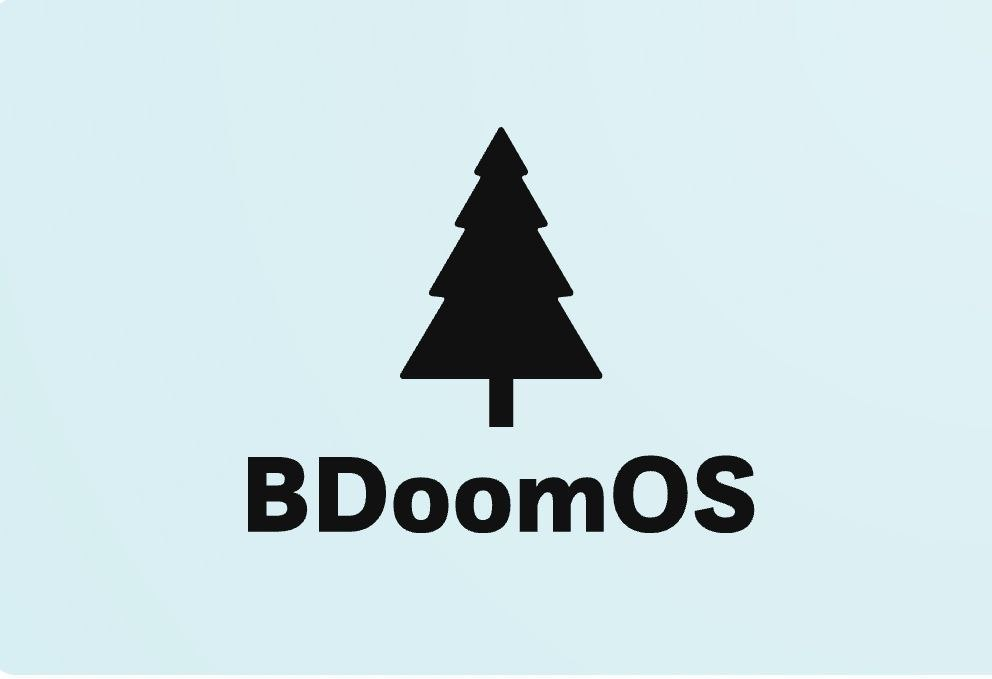

# What is BDoomOS?

BDoomOS is an open source kernel x86 project, it was made in assembly and C 

# How do I compile the system?

To compile the system and its kernel, you need to use the command:

chmod +x build.sh

Then, run the build script with:

./build.sh

If you don't have i686-elf-gcc, use the following command to set up the compiler:

chmod +x gccbuilder.sh

Then, run the script:

./gccbuilder.sh

This will generate an ISO in the disk_images folder. 

# What's in it?

When the system starts, you will enter GRUB, where you'll have the options to turn off the system, restart, or boot into the operating system. If you choose to boot, you will then have additional options to view kernel logs or list files

# Version 0.5

